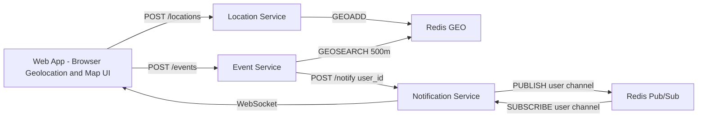

# 架構說明

## 核心資料流

這張圖分成兩條主要路徑：

- 位置更新路徑：Web App 定期把使用者座標送到 Location Service，Location Service 使用 Redis GEO 更新目前位置。
- 事件通知路徑：Web App 發布事件後，Event Service 透過 Redis GEO 查詢 500 公尺內使用者，再請 Notification Service 使用 Redis Pub/Sub 與 WebSocket 推播。
- 地圖更新路徑：Web App 收到新的 GPS 座標或 WebSocket 事件通知後，立即更新使用者 marker、事件 marker 與通知 Banner。

Redis 在圖中拆成 `Redis GEO` 與 `Redis Pub/Sub` 兩個節點，是為了讓報告與 Demo 更容易說明。實作上兩者可以是同一個 Redis instance，只是使用不同資料結構與命令。

即時性與地圖地點更新的詳細資料需求請參考 [realtime-location-requirements.md](./realtime-location-requirements.md)。

## 架構設計原則

- 高頻位置更新與事件推播分開處理，避免單一服務責任太大。
- Location Service 設計成 stateless，方便 Kubernetes 自動擴展。
- Notification Service 使用 Redis Pub/Sub，避免 WebSocket 連線分散在不同 Pod 時收不到通知。
- Redis 只儲存即時位置與即時通知，不作為長期事件資料庫。
- Web App 只負責互動與展示，不直接操作 Redis。

## 服務邊界

| 服務 | 負責 | 不負責 |
|------|------|--------|
| Web App | 地圖、定位、事件表單、通知展示 | 直接查 Redis、K8s 操作 |
| Location Service | 接收座標、更新 Redis GEO、附近查詢 | 事件建立、通知推播 |
| Event Service | 事件建立、半徑查詢、通知觸發 | WebSocket 連線管理 |
| Notification Service | WebSocket、Redis Pub/Sub、指定使用者通知 | 判斷事件半徑、儲存位置 |
| Redis | 即時位置、last_seen、Pub/Sub channel | 長期報表、正式使用者資料 |

## 微服務職責

Location Service:

- 高頻接收使用者 GPS 更新
- 將座標寫入 Redis GEO index
- 是 K8s HPA 的主要展示對象

Event Service:

- 接收插旗事件
- 根據事件座標查詢 500 公尺內使用者
- 呼叫 Notification Service 推播

Notification Service:

- 維護 Web App 的 WebSocket 連線
- 使用 Redis Pub/Sub 解決多副本時的連線分散問題
- 對指定 user_id 推送事件通知
- 可用多副本展示 Pod 被刪除後仍可服務

Redis:

- 使用 GEOADD / GEOSEARCH 暫存即時位置
- 適合高頻率、低延遲的座標查詢
- Pub/Sub 用來支援多副本 Notification Service

## K8s 展示重點

- Deployment: 微服務容器化部署
- Service: 穩定內部 DNS 與流量導向
- HPA: Location Service 依 CPU 使用率從 1 擴展到 5
- Readiness/Liveness Probe: 自動偵測服務健康狀態
- Replica: Notification Service 多副本容錯

## Demo 時可說明的技術點

1. 為什麼不是傳統論壇：論壇需要使用者自己刷新與搜尋，這個系統會根據目前座標主動通知。
2. 為什麼使用 Redis GEO：每秒大量位置更新需要低延遲寫入與附近查詢，Redis GEO 比傳統資料庫查詢更適合 Demo 場景。
3. 為什麼使用 WebSocket：緊急事件需要伺服器主動推播，不能等使用者下一次刷新。
4. 為什麼使用 K8s：Location Service 是高併發入口，可以展示 HPA 自動擴展；Notification Service 可展示 Pod 被刪除後自動恢復。
5. 為什麼拆微服務：不同服務有不同壓力來源，位置更新需要擴展，事件服務重視商業邏輯，通知服務重視連線管理。
